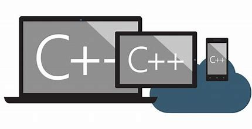

#! https://zhuanlan.zhihu.com/p/466092768



# C/C++ split函数,num2str及str2num函数实现

在C98及其以下版本的C/C++中，没有现成的字符串split函数和num2str及str2num函数，对于竞赛不能使用C11的我来说非常头疼，通过学习stringstream和strtok实现了自己的split函数，通过stringstream和sscanf以及sprint实现了num2str及str2num函数。

## 1. split函数
split函数顾名思义，用来分割字符串，用stringstream实现地函数只能分割空格间隔的字符串，而用strtok实现可以分割任意字符串（这里用的是字符串，意思是可以是单个字符也可以是多个字符作为分隔符）间隔的字符串。
### 1.1 stringstream实现
```c++
/*
split_sstream 用stringstream实现以空格分割字符串
输入为string类型变量s 
输出为经过空格分割后,存储在vector中的字符串数组
*/
vector<string> split_sstream(string s){
	stringstream ss;
	string ans_s;
	vector<string> ans_v;
	
	ss << s;
	
	while(ss >> ans_s){
		ans_v.push_back(ans_s);
	}
	
	return ans_v;
}
```

### 1.2 strtok函数实现
```c++
/*
split_strtok 用strtok实现以delim分割字符串
输入为string类型变量s和分割字符delim 
输出为经过空格分割后,存储在vector中的字符串数组
*/
vector<string> split_strtok(string s, const char* delim = " "){
	string ans_s;
	char * pointer = NULL;
	vector<string> ans_v;
	
	//转换string to char*
	char* s_char = new char[s.size()];
	strcpy(s_char, s.c_str());
	
	pointer = strtok(s_char, delim);
	
	while(pointer != NULL) {
		ans_s = pointer;
		ans_v.push_back(ans_s);
		
		//这里用NULL的原因：
		//源码中会判断是否是第二次调用
		//如果是第二次调用,就会从上次结束的位置后的字符串作为开始 
		pointer = strtok(NULL, delim);
	}
	
	return ans_v;
}

```

## 2. str2num函数
str2num，即str to num函数，将字符串转换成数字的函数，数字可以是整数也可以是浮点数。

### 2.1 stringstream函数实现

```c++
/*
str2num_sstream 用sstream实现将字符串转换成数字 
输入为string类型变量s
输出为double类型变量 
*/

double str2num_sstream(string s){
	
	stringstream ss;
	ss << s;
	
	double ans_d;
	
	ss >> ans_d;
	
	return ans_d; 
}
```

### 2.2 sscanf、sprintf实现

```c++
/*
str2num_sscanf_sprintf 用sscanf和sprintf实现将字符串转换成数字 
输入为string类型变量s
输出为double类型变量 
*/

double str2num_sscanf_sprintf(string s){
	
	const char* s_char = s.c_str();
	
	double ans_d;
	
	
	//sscanf用法和scanf类似，第一个参数表示输入来源，这里即将s_char的内容以%f的形式送给ans_d 
	//注意double用%lf,以及double前面的& 
	sscanf(s_char, "%lf", &ans_d);
	
	return ans_d;
}
```

## 3. num2str函数
num2str, 即num to str函数，将数字转换成对应的字符串的函数，同样的数字可以是整数和浮点数。

### 3.1 stringstream函数实现

```c++
/*
num2str_sstream 用sstream实现将数字转换成字符串
输入为double类型变量num
输出为string类型变量 
*/ 
string num2str_sstream(double num){
	
	stringstream ss;

	string ans_s;
	
	ss << num;
	
	//1
	ss >> ans_s; 
	
	//2
	ans_s = ss.str() ;
	
	return ans_s;
} 
```

### 3.2 sscanf、sprintf实现

```c++
/*
num2str_sscanf_sprintf 用sscanf和sprintf实现将数字转换成字符串
输入为double类型变量num
输出为string类型变量 
*/ 
string num2str_sscanf_sprintf(double num){
	
	string ans_s;
	
	char* s_char;
	
	sprintf(s_char, "%lf", num);
	
	ans_s = s_char;
	
	return ans_s;	
} 
```

## 4. 函数测试

测试函数及主函数代码：
```c++
//遍历vector 
void printVector(vector<string> v){
	vector<string>::iterator it = v.begin();
	
	while(it != v.end()){
		cout << *it << endl;
		it++;
	}
	cout << endl;
}

//测试上述所写函数功能是否正常 
void test(string s1, string s2, double num){
	vector<string> ans_v;
	string ans_str; 
	double ans_d;
	
	//测试split 
	ans_v = split_sstream(s1);
	cout << "split_sstream函数运行结果:" << endl;
	printVector(ans_v);
	
	ans_v = split_strtok(s1, " ");
	cout << "split_strtok函数运行结果:" << endl;
	printVector(ans_v);
	
	//测试str2num 
	ans_d =  str2num_sstream(s2);
	cout << "str2num_sstream函数运行结果:" << endl;
	cout << ans_d << endl << endl;
	
	ans_d =  str2num_sscanf_sprintf(s2);
	cout << "str2num_sscanf_sprintf函数运行结果:" << endl;
	cout << ans_d << endl << endl;
	
	//测试num2str
	ans_str =  num2str_sstream(num);
	cout << "num2str_sstream函数运行结果:" << endl;
	cout << ans_str << endl << endl;
	
	ans_str =  num2str_sscanf_sprintf(num);
	cout << "num2str_sscanf_sprintf函数运行结果:" << endl;
	cout << ans_str << endl << endl;
}

int main(){
	
	test("I LOVE U","123.456", 789.10);
	cout << endl;
	test("Hello World","777", 888); 
	
	//split delim测试
	vector<string> ans_v;
	ans_v = split_strtok("If I were you, I won't do it, right?", ",");
	cout << "以逗号\',\'分割结果为:" << endl; 
	printVector(ans_v);
	
	ans_v = split_strtok("If I were you*! I won't do it*! right? *!", "*!");
	cout << "以星号+感叹号\'*!\'分割结果为:" << endl; 
	printVector(ans_v);
	
	
	return 0;
}
```

测试结果：


## 5. GitHub资源
本文章.md文件及.cpp源代码见个人GitHub仓库：

URL: https://github.com/Little-Chen-T/Zhihu

HTTPS: https://github.com/Little-Chen-T/Zhihu.git
