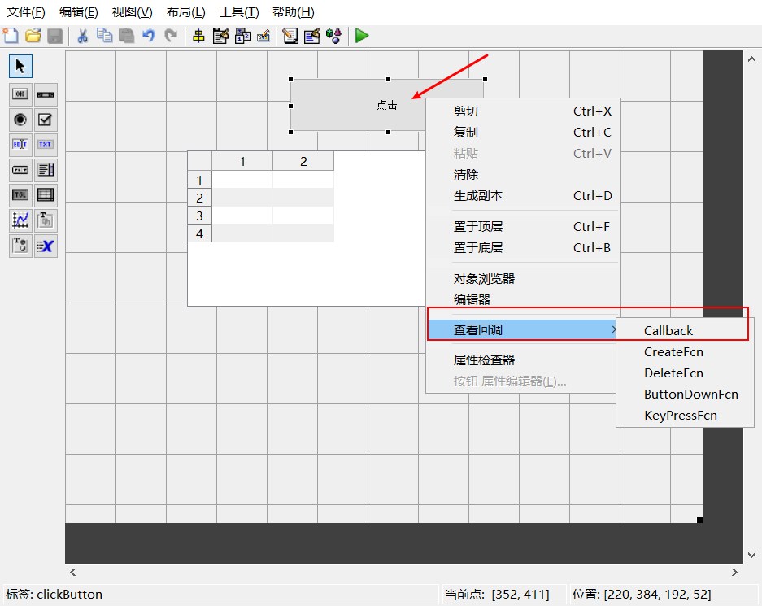

# MATLAB GUI 简易教程及.EXE打包示例
## 1. 新建GUI
新建UI有两种方式：

1) MATLAB工作区新建
2) MATLAB命令栏输入guide


建立好一个新的空白GUI后，进入如下界面


## 2. 简易GUI程序
通过写一个简易程序，记录所需知识。这个简易GUI程序功能如下：有2个GUI，第一个GUI有一个点击按钮和一个uitable，点击按钮后跳转第二个GUI，在第二个GUI里，需要在edit控件中输入2个合法数据（仅限数字），然后将其相乘后存储在excel中，同时显示在第一个GUI中的uitable控件。第二个GUI还有一个关闭按钮，点击这个按钮后将前面保存的excel文件复制一份并关闭当前GUI。

这个简易GUI程序所包含知识点如下：

1) 新建GUI
2) 按钮控件触发对应回调（callback）函数
3) 一个GUI调用另一个GUI
4) 从edit获取数据
5) excel文件读写
5) 通过一个GUI获取另一个GUI控件句柄
6) 为uitable赋值
7) msgbox消息提升
8) copyfile文件复制
9) 关闭GUI

### 2.1 第一个GUI(demoFristGUI)
拖动左边控件图像，在第一个GUI中创建一个按钮，双击按钮控件，将其命名为“点击”，修改其tag为“clickButton”。


然后拖动一个uitable，将其tag命名为"mainTable"。（名字无所谓，只是方便自己开发的时候调用对应的控件）


在按钮上单击右键，选择“查看回调”中的“callback”（这个函数就是点击按钮后执行的函数）。



点击后会自动弹出.m文件，鼠标光标自动跟随到“clickButton”控件的callback函数，在这里编写对应代码。


本程序点击按钮的功能是跳转另一个GUI，先创建另一个GUI命名为“demoSecondGUI”，然后在clickButton的callback函数中写入如下语句：

```MATLAB
set(demoSecondGUI, 'visible', 'on');
```

运行demoFirstGUI.m后点击按钮即可跳转至demoSecondGUI界面。


### 2.2 第二个GUI(demoSecondGUI)

将两个静态文本控件、两个可编辑文本控件、两个按钮控件拖拽到demoSecondGUI中，并做好命名和tag修改，如下图所：


在设计时可通过调整字体大小，利用对齐对象工具等进行界面美化。（我这仅仅作为例子，不浪费时间过多美化）


接下来，编写“确定”按钮函数代码。

首先分析这个按键按下后执行的操作：

1) 获取输入数据1和2中的数据，并判断数据是否合法
2) 然后将其相乘保存在变量中
3) 将相乘结果保存在excel中
4) 让demoFirstGUi中的mainTable显示结果

编写代码过程省略，代码中有详细注释，代码如下（顺便分享一个快捷键：ctrl+r可快速注释MATLAB多行代码，ctrl+t可快速取消多行注释）：

```MATLAB
% --- Executes on button press in OKButton.
function OKButton_Callback(hObject, eventdata, handles)
% hObject    handle to OKButton (see GCBO)
% eventdata  reserved - to be defined in a future version of MATLAB
% handles    structure with handles and user data (see GUIDATA)

% 1) 获取输入数据1和2中的数据，并判断数据是否合法

data1 = get(handles.editFirst, 'string') %editFirst为第一个可编辑文本的tag
data2 = get(handles.editSecond, 'string') %editSecond为第二个可编辑文本的tag

floatData1 = str2num(data1);
floatData2 = str2num(data2);

%row,col 对应floatData行数、列数
[row1, col1 ]= size(floatData1);
[row2, col2 ]= size(floatData2);

% 当输入的是类似“12 23”这种以空格分割的字符时，str2num会得到数字数组，长度不为1
% 当输入包含非数字的字符时，str2num得到的结果是[]，空矩阵，isempty判断结果为真
if (col1~=1 || col2 ~=1 || isempty(floatData1)...
    || isempty(floatData2))
    
    f1 = msgbox('输入数据非法！请输入数字！','error' ,'error');
else
    f2 = msgbox('输入成功！');
    
    % 2) 然后将其相乘保存在变量中
    result = floatData1*floatData2
    
    % 由于后面用readtable函数读取数据会自动将第一行数据作为列名称省略，故增广数据为2行1列
    result = [result;result];
    
    % 3) 将相乘结果保存在excel中
    xlswrite('result.xls', result);
    
    % 4) 让demoFirstGUi中的mainTable显示结果
    
    % findobj函数去寻找demoFirstGUI中tag名为mainTable的句柄，这是为了后面操作
    h = findobj(demoFirstGUI, 'tag', 'mainTable');
    
    % readtable 函数从excel中读取数据
    resultFromExcel = readtable('result.xls');
    
    % table2cell函数将table类型数据转换为cell类型，uitable数据不能用table类型赋值    
    cellData = table2cell(resultFromExcel);
        
    %set函数将uitable数据赋值
    set(h, 'data', cellData);
end

```

关闭按钮代码如下：

```MATLAB
% --- Executes on button press in shutDownButton.
function shutDownButton_Callback(hObject, eventdata, handles)
% hObject    handle to shutDownButton (see GCBO)
% eventdata  reserved - to be defined in a future version of MATLAB
% handles    structure with handles and user data (see GUIDATA)

% 用copyfile将result.xls移动到D盘根目录
status = copyfile('result.xls', 'D:\');

if status == 1
    f1 = msgbox('复制成功！');
    
    % 关闭当前GUI
    close(demoSecondGUI);
else
    f2 = msgbox('复制失败！','error', 'error');
end

```
下面为运行效果


## 3. 打包

MALTBA命令行输入“deploytool”，然后点击"Application Compiler"


设置好红框里的内容，然后点击右上方的“Package”即可开始打包


注意右上方的runtime选择，第一种选择是让安装的用户下载runtime，这种打包后安装包比较小，但是下载速度慢。第二种是将runtime集成在安装包内，安装包较大，但是安装速度快。视个人情况选择runtime打包方式。

## 4. GitHub资源
本文章.md文件及GUI源代码见个人GitHub仓库：

URL: https://github.com/Little-Chen-T/Zhihu

HTTPS: https://github.com/Little-Chen-T/Zhihu.git


